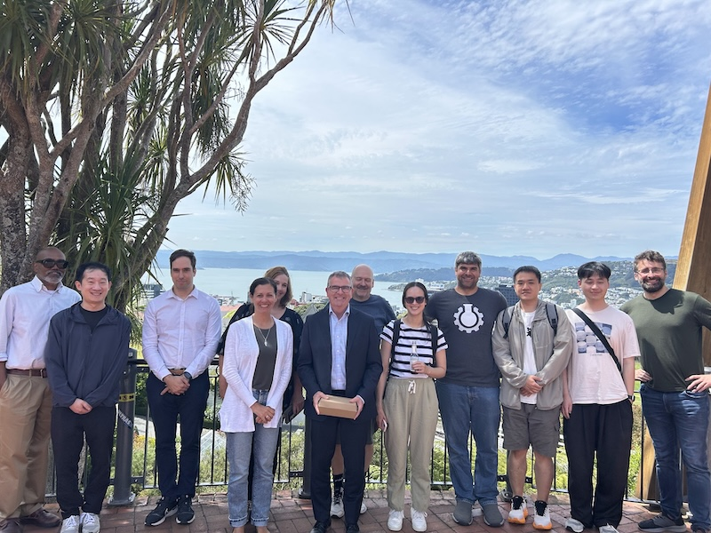
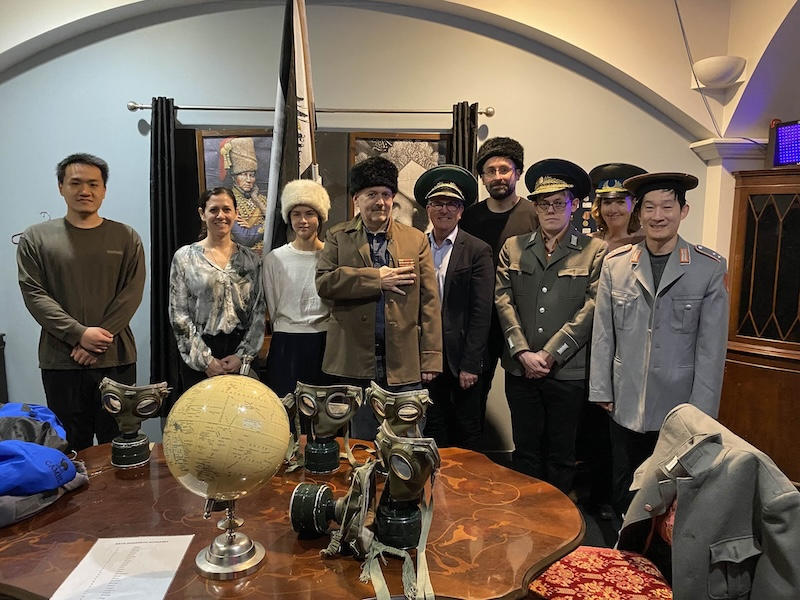

####
# News

Follow our project on [LinkedIn](https://www.linkedin.com/company/ssc-fort) !

### 13 Feb 26: Talk at Deloitte

Jens will give a talk at Deloitte about software supply chain security in Wellington, organised by [Joanne Lu](https://www.linkedin.com/in/joanne-lu-b2423413/?originalSubdomain=nz).

**Please contact us if you are interested for us to give a talk at your organisation on the state and challenges in Software Supply Chain security !**

### 12 Feb 26: Project In-Person Meeting at Victoria University of Wellington

This is our first in-person meeting in Wellington in 2026 ! Several advisory board members are attending as well. We have a set of technical talks scheduled: 

- Elliott: a binary equivalence dataset for rust
- Alix: using AI for binary equivalence
- Max: creating a scalable index for clone detection
- Jens: equivalence of generated sources
- Jens and Elliott: CVE-2025-55182 react2shell update
- Lisa: focus group study
- Xiang: Studying Deserialization of AI datasets from HuggingFace

### 11 Feb 26: Talk at RMIT

Jens will give a talk  at RMIT in Melbourne about software supply chain security.

### 9 Feb 26: SCC-FORT @ OzSe'26 (9-10 Feb 26)

Valerio and Jens are invited speakers at the [Australian Summer School in Software Engineering OzSE'26](https://ozse-school.github.io/) in Melbourne, focussing on AI in Software Engineering. Jens will talk about software supply chain issues, Valerio about metamorphic testing of LLMs. 

### 26 Jan 26: Shawn Rasheed is joining the Project as Senior Engineer

We are delighted to announce that Shawn is joining the project. Shawn holds a PhD from Massey University, supervised by Jens and [Amjed Tahir](https://www.massey.ac.nz/massey/expertise/profile.cfm?stref=481450) on deserialization vulnerabilities. This led to the discovery of several new vulnerabilities including CVE-2019-17063 (PDFxStream), CVE-2019-20446 (librvg), CVE-2018-11797 (PDFBox) and CVE-2018-19478 (GhostScript). Welcome on board Shawn !

### 26 Jan 26: Tony McLoughlin is joining the Project as Project Manager

We are delighted to announce that Tony is joining the project in March as pur project manager.
Tony is already working for the School of Engineering and Computer Science at Victoria University of Wellington and has worked with many of us already. 

### 11 Dec 25: Project In-Person Meeting at University of Auckland

The team will meet in Auckland to discuss ongoing work and plan ahead.

### 16 Nov 25: SCC-FORT @ ASE'25 (16-20 Nov 25)

Valerio and Jens will give talks at the [40th IEEE/ACM International Conference on Automated Software Engineering (ASE'25)](https://conf.researchr.org/home/ase-2025) in Seoul, Korea. ASE'25 is one of the 3 top-rated conferences in Software Engineering. 
Jens will talk about [daleq](https://github.com/binaryeq/daleq/), a tool to assess rebuilds, Valerio will talk about Oracles to test LLMs. 

### 22 Oct 25: Lisa Patterson is joining the Project as PostDoc

We are excited to announce that our first postdoc, Dr. Lisa Patterson, is joining our team on 1 Nov. Lisa has extensive experience working in the private sector and working with government. Lisa holds a Phd in Cybersecurity from Victoria University of Wellington.  Welcome on board Lisa !

### 13-14 Oct 25: Project Kick-off Meeting in Wellington

The team is meeting for our project kick-off meeting in Wellington. 

After two days of planning we went to a local soviet-themed escape room for team building :-) .

### 25 Sep 25: Project Starting

The project will start on 1 October 2025 !

